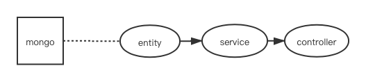
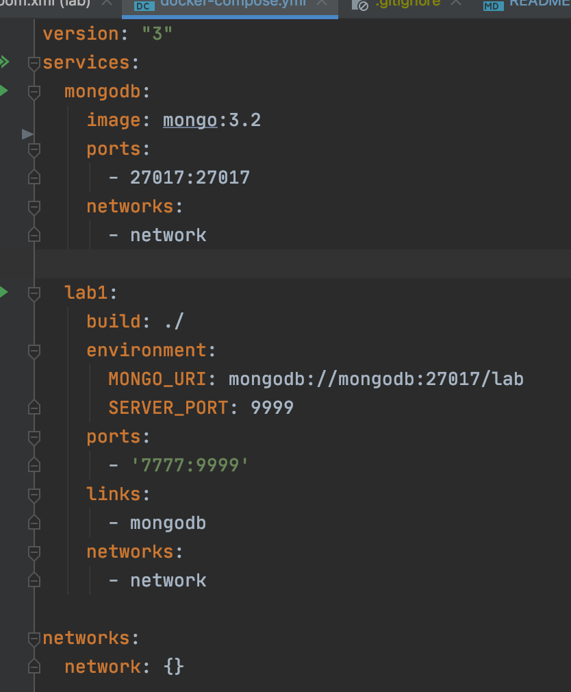

---

- [API使用说明](#api使用说明)
- [项目开发](#项目开发)
- [项目部署](#项目部署)
  - [docker-compose](#docker-compose)

---

## API使用说明
```
得到所有同学的信息
GET localhost:7777/api/v1/student

```

```
创建一位同学
POST localhost:7777/api/v1/student

Body student {
        "idCard":"",
        "attrs":{}
     }

```

```
删除一位同学
DELETE localhost:7777/api/v1/student？idCard=""

```

```
修改一位同学
PUT localhost:7777/api/v1/student

Body student {
        "idCard":"",
        "attrs":{}
     }

```


## 项目开发
项目采用了 Restful 的风格开发API。

采用的技术栈为：springboot、mongo、docker、docker-compose。

项目分为三层从底向上进行开发，如图所示



## 项目部署

### docker-compose

项目采用了docker-compose进行部署，如图所示。

